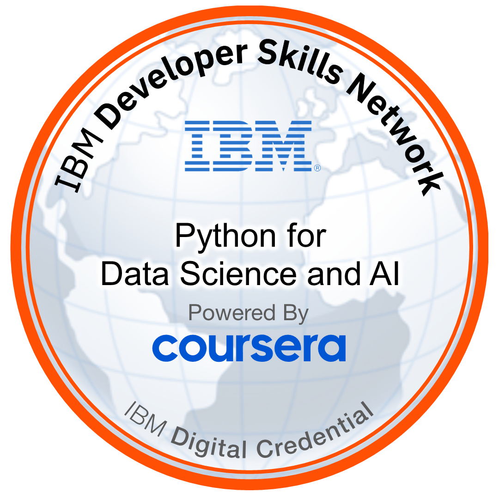
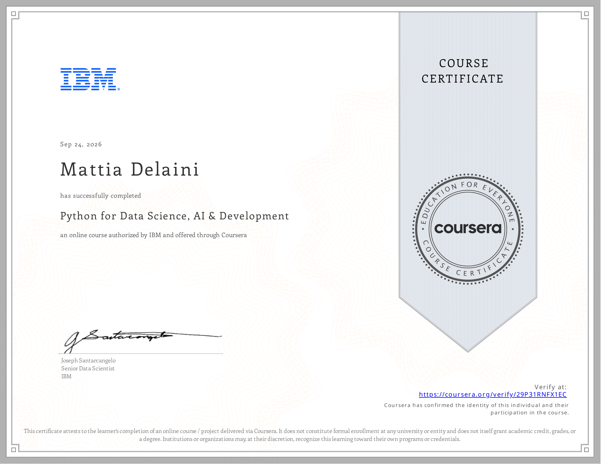

<div align="center">

# Mattia Delaini

### `masteroid007`

**Computer Science Student · Python Developer**

<br>

[](https://github.com/masteroid007)
[](https://discord.com/users/856211106731917312)
[](https://t.me/masteroid007)

</div>

---

## About Me

I'm **Mattia Delaini**, also known online as **masteroid007**.

I'm a **Computer Science student** with a strong interest in software development and modern technologies.

My main programming language is **Python**, and I'm particularly interested in **Cybersecurity, Artificial Intelligence, Backend Development, and Data Science**.

I'm constantly learning and improving my skills through courses, practical work, and personal experimentation.

---

## Badges

<div align="center">

<a href="https://www.credly.com/badges/35b205de-fa59-46fd-8d15-85781b5cafb3/public_url">
  
</a>

<br><br>

</div>

---

## Technical Skills

### Programming Language


### Tools & Platforms


---

## Areas of Interest

| Area                        | Focus                                                 |
| :-------------------------- | :---------------------------------------------------- |
| **Cybersecurity**           | Security, networks and system protection              |
| **Artificial Intelligence** | AI technologies and intelligent systems               |
| **Backend Development**     | APIs, servers, databases and application architecture |
| **Data Science**            | Data analysis, processing and Python-based solutions  |

---

## Currently Learning

```text id="dx14mw"
Python
├── Object-Oriented Programming
├── Data Processing
├── APIs & Web Scraping
└── Software Development

Exploring
├── Cybersecurity
├── Artificial Intelligence
├── Backend Development
└── Data Science
```

---

## Certifications

### Coursera

<div align="center">

<a href="https://coursera.org/share/42a89c2f20043de4b204a66001feba5f">
  
</a>

</div>

---

## Contact

<div align="center">

[](https://discord.com/users/856211106731917312)
[](https://t.me/masteroid007)

<br><br>


</div>

---

<div align="center">

<sub>Computer Science Student · Python Developer · Technology Enthusiast</sub>

</div>
